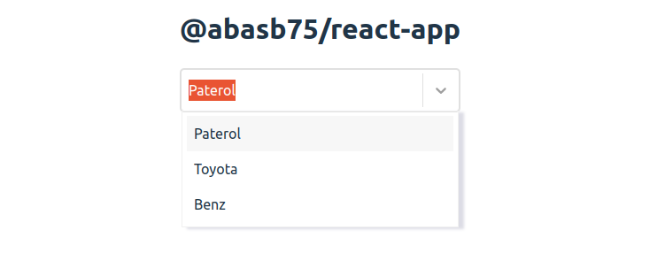

add to reactjs :

```sh

npm install @abasb75/react-select --save

```

usage example :


```javascript


import Select from "@abasb75/react-select";

function App() {

  return (<div id="app">
    <div>
      <h1>@abasb75/react-select</h1>
      <Select 
        options={[
          {label:'Paterol',value:'0'},
          {label:'Toyota',value:'1'},
          {label:'Benz',value:'2'}
        ]} 
        defaultValue={'1'}
      />
    </div>
  </div>)
}

export default App;

```


props :

<!-- props-table-start -->
## Properties
    

| Property | PropType | Required | Default | Description |
|----------|----------|----------|---------|-------------|
| options | `ISelectOption[]` | `1` |  |  |
| placeholder | `string` | `0` | `Select ...` |  |
| defaultValue | `string` | `0` |  | |
| onChange | `(option?:ISelectOption)=>void` | `0` | `''` | |
| className | `string` | `0` | `''` | select container classes |
| optionClassName | `string` | `0` | `''` | select option items classes |
| activeOptionClassName | `string` | `0` | `''` | select active option item classes |
| optionsClassName | `string` | `0` | `''` | select options container classes |
| arrowClassName | `string` | `0` | `''` | select arrow container classes |
| arrowSvgClassName | `string` | `0` | `''` | select svg arrow classes |
| valueClassName | `string` | `0` | `''` | select container classes |
| style | `React.CSSProperties` | `0` | `''` | select container inline styles |
| optionStyle | `React.CSSProperties` | `0` | `''` | select option items inline styles |
| activeOptionStyle | `React.CSSProperties` | `0` | `''` | select active option item inline styles |
| optionsStyle | `React.CSSProperties` | `0` | `''` | select options container inline styles |
| arrowStyle | `React.CSSProperties` | `0` | `''` | select arrow container inline styles |
| arrowSvgStyle | `React.CSSProperties` | `0` | `''` | select svg arrow inline styles |
| valueStyle | `React.CSSProperties` | `0` | `''` | select container inline styles |
| OptionComponent | `React.FC` | `0` | `''` | Alternative component for default OptionItem component |
| ValueComponent | `React.FC` | `0` | `''` | Alternative component for default selected Value component |


<!-- props-table-end -->